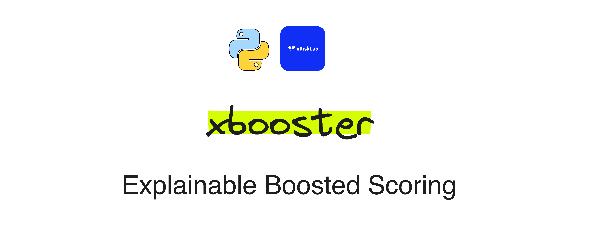
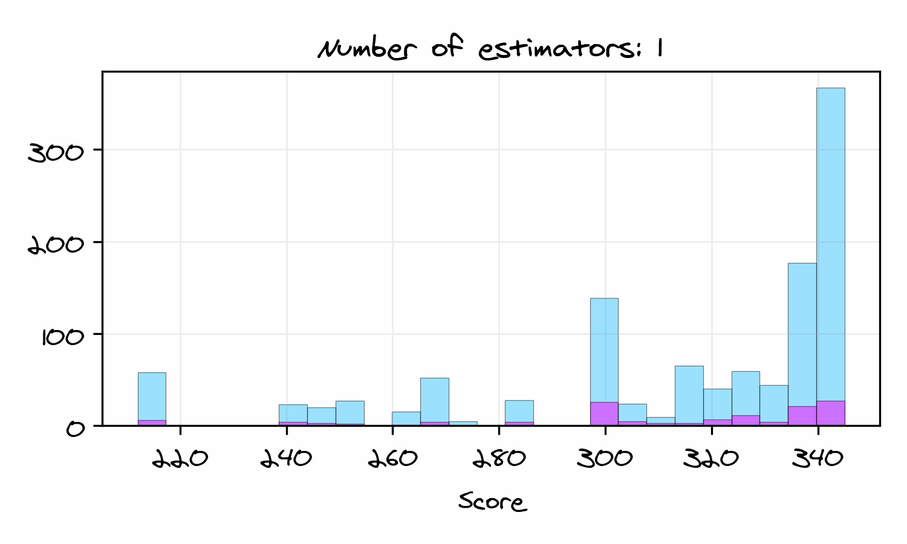

<h1 align="center">
Explainable Boosted Scoring (xbooster)
</h1>

 

If you like scorecards and gradient boosting, this repo is for you! This is the first attempt to productionize credit scoring models with gradient boosting. The xbooster library serves as an extension of XGBoost logistic regression tailored to the needs of model developers and validators.

What problems does xbooster help you solve?

1. Boost model accuracy ratio: Gain better predictive performance during model development.
2. Open up the “black box”: Leverage tree visualization, global and local importance features.
3. Streamline deployment and validation: Deploy using simple SQL and analyze models.

Install with `pip install xbooster` ⭐

[💻 Colab notebook](https://colab.research.google.com/github/deburky/boosting-scorecards/blob/main/other_notebooks/xbooster-getting-started.ipynb)

# Scorecard Boosting 🚀

Scorecard boosting is an innovative methodology for constructing credit scorecards by leveraging advanced machine learning (ML) techniques, specifically gradient boosting, that [emerged in the domain of Credit Risk](https://blogs.nvidia.com/blog/ai-credit-risk-scotiabank/).

## Gradient Boosting 📈

[Gradient boosting](https://en.wikipedia.org/wiki/Gradient_boosting), which lies at the 💚 of scorecard boosting, is an ML technique that builds a predictive model by combining the outputs of multiple "weak" models, typically decision trees, to create a strong predictive model. 

The algorithm works sequentially, with each new model focusing on correcting errors made by the previous ones. It minimizes a loss function by adding new models to the ensemble, and the final prediction is the sum of the predictions from all models.

One of the most known frameworks for gradient boosting with decision trees is [XGBoost](https://web.njit.edu/~usman/courses/cs675_fall16/BoostedTree.pdf). XGBoost is an optimized distributed gradient boosting library designed to be highly efficient, flexible, and portable.

For binary classification tasks like credit scoring, XGBoost performs a form of Logistic Regression. The algorithm is trained to minimize the [log loss](https://en.wikipedia.org/wiki/Cross_entropy#Cross-entropy_loss_function_and_logistic_regression) function, which is the negative log-likelihood of the true labels given a probabilistic model.

The algorithm used in XGBoost Logistic Regression [follows](https://en.wikipedia.org/wiki/XGBoost) the Newton-Raphson update method, which was initially described by [J. Friedman (2001)](https://projecteuclid.org/journals/annals-of-statistics/volume-29/issue-5/Greedy-function-approximation-A-gradient-boosting-machine/10.1214/aos/1013203451.full). XGBoost Logistic Regression also has ties to LogitBoost, which was described by [J. Friedman et al. (2000)](https://projecteuclid.org/journals/annals-of-statistics/volume-28/issue-2/Additive-logistic-regression--a-statistical-view-of-boosting-With/10.1214/aos/1016218223.full#:~:text=Boosting%20works%20by%20sequentially%20applying,in%20dramatic%20improvements%20in%20performance).

To familiarize yourself further with gradient boosting and XGBoost follow the links below:
* [How to explain gradient boosting](https://explained.ai/gradient-boosting/)
* [Understanding Gradient Boosting as a gradient descent](https://nicolas-hug.com/blog/gradient_boosting_descent)
* [Around Gradient Boosting: Classification, Missing Values, Second Order Derivatives, and Line Search](https://nicolas-hug.com/blog/around_gradient_boosting)
* [How Does Extreme Gradient Boosting (XGBoost) Work?](https://cengiz.me/posts/extreme-gradient-boosting/)

## Boosted Scorecards 💳

Boosted scorecards built on top of gradient-boosted trees allow to improve performance metrics like Gini score and Kolmogorov-Smirnov (KS) statistic compared to standard tools, while maintaining the interpretability of traditional scorecards. 📊 This is achieved by combining the best of both worlds: the interpretability of scorecards and the predictive power of gradient boosting. 🌐

A boosted scorecard can be seen as a collection of sequential decision trees transformed into a traditional scorecard format. 🌲 This scorecard comprises rules essential for computing a credit score, an evaluative measure of creditworthiness of new or existing customers. Typically ranging from 300 to 850, this score can be further customized using the Points to Double the Odds (PDO) technique, a concept extendable to gradient boosted decision trees.

Below we can see how the number of boosting iterations affects the distribution of boosted credit scores among good and bad customers:

## Useful resources 📖

- [Scorecard boosting repo: notebooks and other supplementary materials](https://github.com/deburky/boosting-scorecards)
- [Boosting for Credit Scorecards and Similarity to WOE Logistic Regression](https://github.com/pedwardsada/real_adaboost/blob/master/real_adaboost.pptx.pdf)
- [Machine Learning in Retail Credit Risk: Algorithms, Infrastructure, and Alternative Data — Past, Present, and Future](https://www.nvidia.com/ko-kr/on-demand/session/gtcspring21-s31327/)
- [Building Credit Risk Scorecards with RAPIDS](https://github.com/rapidsai-community/showcase/tree/main/event_notebooks/GTC_2021/credit_scorecard)
- [XGBoost for Interpretable Credit Models](https://wandb.ai/tim-w/credit_scorecard/reports/XGBoost-for-Interpretable-Credit-Models--VmlldzoxODI0NDgx)
- [`credit_scorecard` - Project](https://wandb.ai/morgan/credit_scorecard/overview)
- [`vehicle_loan_defaults` - Artifacts 📊](https://wandb.ai/morgan/credit_scorecard/artifacts/dataset/vehicle_loan_defaults/v1)