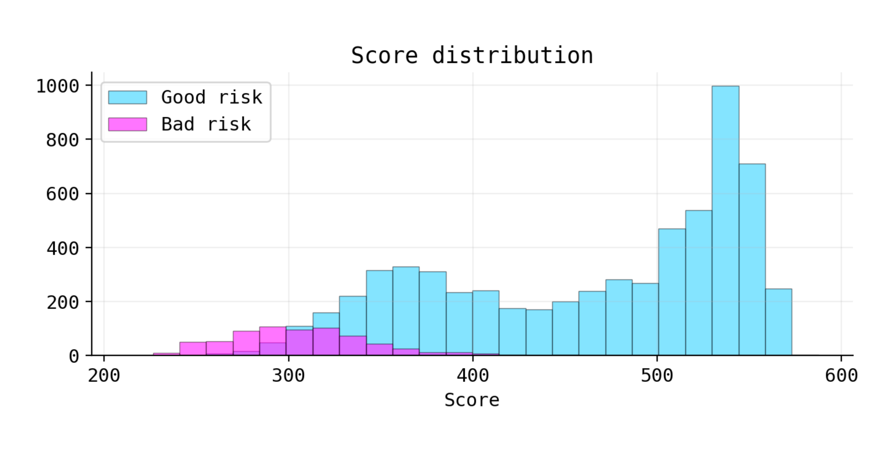
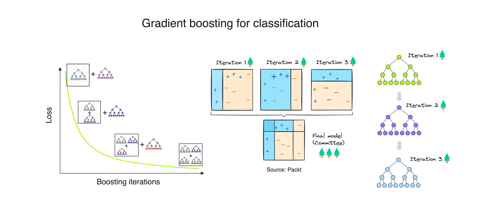
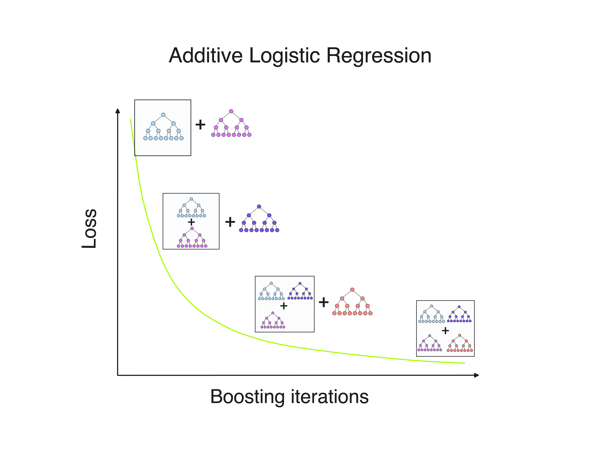
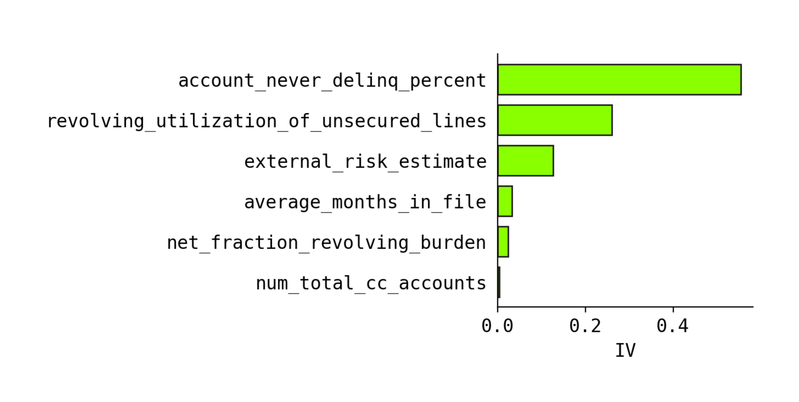
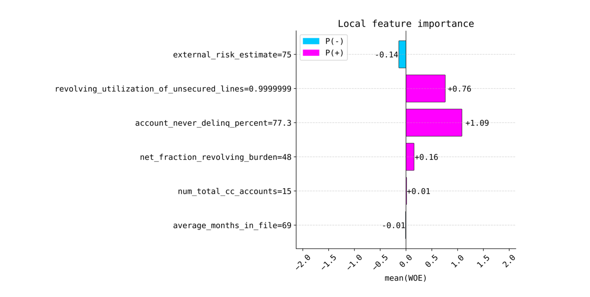

# Methodology

This section documents the methodology behind the xbooster library, which is designed to build credit scorecards with XGBoost. The library extends the scorecard boosting methodology with the inclusion of Weight of Evidence (WOE) as another method for building credit scorecards with XGBoost.



## Introduction

<span style="font-family: Karma, sans-serif;">

In recent years, gradient boosting algorithms have revolutionized machine learning with their exceptional performance. However, understanding their inner workings and interpretability has often been challenging.



The methodology for scorecard boosting, pioneered by Paul Edwards, addresses this gap. xbooster library builds upon this methodology, extending it with the inclusion of Weight of Evidence (WOE) as another method for building credit scorecards with XGBoost.

The underlying framework of xbooster is based on likelihood theory. This framework enables to build and validate boosted scoring systems, quantify feature importance, and perform model validation effectively using a well-known suite of credit scoring metrics.

Boosting iterations by XGBoost produce margins (log-odds), which can be interpreted as likelihood ratios relative to the base score. By treating these margins as likelihoods, xbooster conceptualizes the boosting process as an iterative procedure aimed at maximizing the likelihood of the observed data (Maximum Likelihood Estimation or MLE).



<details>
  <summary class="summary-box"><b>Important terminology</b><br> Explore the metrics used in the xbooster library.</summary>
  <p><b>Weight of Evidence (WOE)</b>: calculates the log-odds of the event rate in a specific group relative to the event rate in the entire dataset. WOE in the context of gradient boosting is a (log) likelihood ratio that measures deviations from the average event rate in a given tree. WOE is defined as p("bad") / p("good") to match the direction of leaf weights (XAddEvidence) and WOE in this library.</p>
  <p><b>Information Value (IV)</b>: Shannon Information Value (IV).</p>
  <p><b>Leaf weights (XAddEvidence)</b>: gradient boosting margins, which can be interpreted as likelihood ratios.</p>
  <p><b>Points</b>: calculates credit scorecard points based on the XAddEvidence or WOE and the PDO (Points to Double the Odds) method.</p>
  <p><b>Likelihood</b>: the exponent of WOE. When visualizing metrics for interpretability, we have an option to normalize to 1.</p>
</details>

</span>

## Boosting and Likelihood

This section provides an overview of the xbooster's interpretability functionality for trees with depth larger than one.

### Global Interpretability

The snippet below demonstrates how to plot global feature importance using the xbooster library.

```python
from xbooster.explainer import plot_importance

plot_importance(
    scorecard_constructor,
    metric="IV",
    method="global",
    normalize=True,
    color="#a7fe01",
    edgecolor="#1e1e1e",
    figsize=(5, 5),
    dpi=120,
    title="Feature importance",
)
```


<span style="font-family: Karma, sans-serif;">

We can view an ensemble of gradient boosted trees as a summation of margins, leaf log-odds which are scaled by the learning rate. Each boosting iteration produces a margin, which can be interpreted as a likelihood vis-a-vis the base score (intercept). At each iteration, the boosting machine updates its previous likelihood by fitting a new decision tree to update the previous margin. As such, the boosting ensemble produces a series of likelihoods, which are eventually summed to obtain the final prediction.

It is important to note the difference between a tree depth of 1 (stump) and larger depths. We can use a `global` method from `explainer.plot_importance()` only for stumps. For larger trees, we need to recreate individual splits and measure feature importance via a likelihood ratio.

What follows is a description of the approach to global feature importance for models with depth greater than one.

</span>

#### Interpreting Split Conditions

<span style="font-family: Karma, sans-serif;">

By examining how samples traverse through the trees and end up in specific leaf nodes, we can evaluate the impact of different feature combinations and their likelihood ratios on the model's predictions. 

Consider a split in one of the gradient boosting trees:

</span>

| Tree | Node | Feature                               | Sign | Split   | Count | CountPct | NonEvents | Events | EventRate | WOE  | XAddEvidence | DetailedSplit |
|------|------|---------------------------------------|------|---------|-------|----------|-----------|--------|-----------|------|--------------|---------------|
| 0    | 3    | revolving_utilization_of_unsecured_lines | <    | 0.60931 | 1901  | 0.27157  | 1669      | 232    | 0.1220    | 0.224 | -0.1801      | account_never_delinq_percent < 98, revolving_utilization_of_unsecured_lines < 0.60930562 |

<span style="font-family: Karma, sans-serif;">

This split forms a one-way interaction table with two features. The resulting margin ("XAddEvidence") for this specific split will be -0.1801. The event rate in this split is 12%, and approximately 27% of observations are contained in this split. Given that our base odds are 16%, this is not a very large deviation from the initial odds.

To calculate the likelihood, we can use the following formula:

1. The initial odds are 0.11.
2. The event rate in this split is 0.1220, so the odds are 0.1220 / (1 - 0.1220) = 0.1390.
3. To get the likelihood, divide 0.1390 by the initial odds = 0.1390 / 0.11 = 1.251.
4. If we take the natural logarithm of this value, we get 0.224, which is also a weight of evidence.

In essence, the likelihood of this split indicates more evidence in favor of our event of interest (credit default). However, when looking at the results, we would probably associate it with the last feature used in the split, i.e., revolving_utilization_of_unsecured_lines < 0.60931. 
</span>

#### Likelihood Ratio

<span style="font-family: Karma, sans-serif;">

For models with depth greater than one, to measure the relative importance of each factor in a split, we can use a likelihood ratio, where one likelihood is associated with the terminal node, and another one measures the likelihood of an individual split condition within a branch.

[💻 Link to the code where it is implemented](https://github.com/xRiskLab/xBooster/blob/fc56c957975c17c42f973437cd86be331e881f7a/xbooster/explainer.py#L286)

Consider the following likelihoods from individual splits:

</span>

| Tree | Node | Feature                               | Sign | Split   | EventRate | Odds  | WOE    | Likelihood L(θ2∣x) |
|------|------|---------------------------------------|------|---------|-----------|-------|--------|---------------------|
| 0    | 0    | account_never_delinq_percent          | <    | 98.0000 | 0.23986   | 0.31554| 1.04376| 2.83989             |
| 0    | 0    | revolving_utilization_of_unsecured_lines | <  | 0.6093  | 0.04555   | 0.04772| -0.84509| 0.42952            |

<span style="font-family: Karma, sans-serif;">

From this table, we can derive the following: the split on `revolving_utilization_of_unsecured_lines` is more important for this specific split because the event rate of this individual split is 4.5%, and the final leaf’s event rate is 12%. Comparing the second split on `account_never_delinq_percent`, we can see that its event rate is 23%, which is further away from the leaf’s event rate (12%).

Now we can calculate the likelihoods of individual split conditions, not in combination with each other.
</span>

| Tree | Node | Feature                               | Sign | Split   | Count | Events | NonEvents | EventRate | WOE     | Odds   | Likelihood L(θ2∣x) |
|------|------|---------------------------------------|------|---------|-------|--------|-----------|-----------|---------|--------|---------------------|
| 0    | 0    | account_never_delinq_percent          | <    | 98.0000 | 2810  | 674    | 2136      | 0.23986   | 1.04376 | 0.31554| 2.83989             |
| 0    | 0    | revolving_utilization_of_unsecured_lines | <  | 0.6093  | 5225  | 238    | 4987      | 0.04555   | -0.84509| 0.04772| 0.42952            |

<span style="font-family: Karma, sans-serif;">
Likelihood calculated here compares the odds to the sample odds (odds of the average default rate, which is 10%).

The general idea is that if the likelihood of a split is similar to the likelihood of weight, we can consider these two splits to be more “related”. For example, if the leaf event rate is 1% and the split 1 event rate is 2% while split 2 event rate is 20%, we should consider split 1 to have higher importance.
</span>

#### Comparing Likelihoods

<span style="font-family: Karma, sans-serif;">
From the table above, we can derive the following likelihood ratios:
</span>

| Tree | Node | Feature                               | Sign | Split   | Likelihood L(θ1∣x) | Likelihood L(θ2∣x) | L(θ1∣x) / L(θ2∣x) | Odds 1 | Odds 2 | Odds 1 / Odds 2 | WOE1 | WOE2 | WOE2 - WOE1 | e^(WOE1 - WOE2) |
|------|------|---------------------------------------|------|---------|---------------------|---------------------|--------------------|--------|--------|-----------------|-------|-------|--------------|-----------------|
| 0    | 3    | account_never_delinq_percent          | <    | 98.0000 | 1.25105             | 2.83989             | 0.44053            | 0.13901| 0.31554| 0.44053         | 0.224 | 1.04376| -0.81978      | 0.44053         |
| 0    | 3    | revolving_utilization_of_unsecured_lines | <  | 0.6093  | 1.25105             | 0.42952             | 2.91269            | 0.13901| 0.04772| 2.91269         | 0.224 | -0.84509| 1.06908      | 2.91269         |


<span style="font-family: Karma, sans-serif;">
These likelihood ratios provide insights into the relative importance of each factor in a split, with respect to the final decision. 
</span>

## Local Interpretability

<span style="font-family: Karma, sans-serif;">

The snippet below demonstrates how to plot local feature importance using the xbooster library.

```python
from xbooster import explainer

# Choose a sample
sample_idx = 2

explainer.plot_local_importance(
    scorecard_constructor,
    X.loc[ix_test][sample_idx : sample_idx + 1],
    figsize=(6, 6),
    fontsize=14,
    dpi=120,
    title="Local feature importance",
)
```



For local explanations for boosters with depth greater than one, we use an approach of calculating the importance of each split condition. 

To provide local explanations, we perform the calculation of WOE for individual splits and use WOE as a metric that measures deviations from the average. For stumps, SHAP and xbooster local explanations are the same, since SHAP uses XGBoost's log-odds to calculate the importance of each feature.

[💻 Link to the code where it is implemented](https://github.com/xRiskLab/xBooster/blob/fc56c957975c17c42f973437cd86be331e881f7a/xbooster/explainer.py#L647)
</span>

